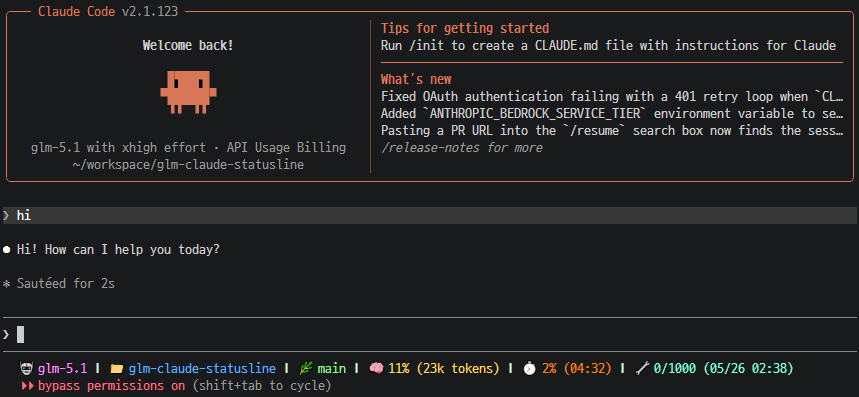

<div align="center">

# GLM + Claude Code Statusline

A rich, color-coded status line for [Claude Code](https://docs.anthropic.com/en/docs/claude-code)
displays real-time model info, context usage, and GLM Coding Plan API quota — all in your terminal prompt.



</div>


## ✨ Features

<table>
<tr><td>🤖 <strong>Model</strong></td><td>Current model name (e.g. <code>glm-5.1</code>)</td></tr>
<tr><td>📁 <strong>Folder</strong></td><td>Active workspace directory</td></tr>
<tr><td>🌿 <strong>Branch</strong></td><td>Current git branch <em>(auto-hidden outside repos)</em></td></tr>
<tr><td>🧠 <strong>Context</strong></td><td>Context window usage % with human-readable token count</td></tr>
<tr><td>⏱️ <strong>5h Token Quota</strong></td><td>Rolling 5-hour token limit % with reset time</td></tr>
<tr><td>📆 <strong>Weekly Quota</strong></td><td>Rolling 7-day token limit % with reset date</td></tr>
<tr><td>🔧 <strong>Tool Quota</strong></td><td>Monthly tool quota with reset date</td></tr>
</table>

### Highlights

- **Single `jq` call** for input parsing — minimal overhead
- **60-second quota cache** — avoids hammering the API on every status refresh
- **ANSI color-coded** — each segment has a distinct color for instant readability
- **Smart segments** — git branch and quota sections only appear when available

## 📋 Prerequisites

| Dependency | Purpose |
|-----------|---------|
| [Claude Code](https://docs.anthropic.com/en/docs/claude-code) | CLI that provides the statusline hook |
| [`jq`](https://jstedfast.github.io/jq-manual/) | Lightweight JSON processor |
| `curl` | Quota API requests |
| `git` | Branch detection |


## 🚀 Installation

### Step 0 — Install `jq`

<details>
<summary>macOS</summary>

```bash
brew install jq
```
</details>

<details>
<summary>Ubuntu / Debian</summary>

```bash
sudo apt update && sudo apt install -y jq
```
</details>

<details>
<summary>Fedora / RHEL</summary>

```bash
sudo dnf install -y jq
```
</details>

<details>
<summary>Arch Linux</summary>

```bash
sudo pacman -S jq
```
</details>

<details>
<summary>Windows (WSL / Scoop / Chocolatey)</summary>

```bash
# WSL (Ubuntu)
sudo apt update && sudo apt install -y jq

# Scoop
scoop install jq

# Chocolatey
choco install jq
```
</details>

> Verify with `jq --version`.

### Step 1 — Download the script

```bash
mkdir -p ~/.claude
curl -o ~/.claude/statusline.sh https://raw.githubusercontent.com/luviles/glm-claude-statusline/main/scripts/statusline.sh
chmod +x ~/.claude/statusline.sh
```

### Step 2 — Configure Claude Code

Edit `~/.claude/settings.json` and add the statusline entry:

```json
{
  "statusline": {
    "enabled": true,
    "command": "~/.claude/statusline.sh"
  }
}
```

> If the file already exists, just add the `"statusline"` block inside the top-level `{}`.

## 🎨 Color Reference

| Segment | Color | ANSI Code |
|---------|-------|-----------|
| 🤖 Model |  `#ff87ff` | `38;5;213` |
| 📁 Folder |  `#5fafff` | `38;5;75` |
| 🌿 Branch |  `#87ff87` | `38;5;120` |
| 🧠 Context |  `#ffd75f` | `38;5;221` |
| ⏱️ 5h Quota |  `#ff8700` | `38;5;208` |
| 📆 Weekly Quota |  `#ff5f5f` | `38;5;203` |
| 🔧 Tool Quota |  `#87ffd7` | `38;5;122` |


## ⚙️ How It Works

```
Claude Code ──JSON──▶ statusline.sh ──▶ ANSI-colored status line
                            │
                    ┌───────┴───────┐
                    │  Single jq    │  Parse model, cwd, context
                    │  invocation   │
                    └───────┬───────┘
                            │
                    ┌───────┴───────┐
                    │  Quota API    │  Fetch if env vars set
                    │  (60s cache)  │  Cache in /tmp
                    └───────────────┘
```

1. Claude Code pipes a JSON payload to the script via **stdin** on every status refresh
2. The script extracts model, workspace, and context window data in a **single `jq` invocation**
3. If `ANTHROPIC_BASE_URL` and `ANTHROPIC_AUTH_TOKEN` are set, it fetches quota data from the `/api/monitor/usage/quota/limit` endpoint
4. Quota responses are **cached for 60 seconds** in `/tmp/.claude-quota-cache` to minimize API calls
5. All segments are assembled into a single ANSI-colored line printed to **stdout**

## 📄 License

This project is licensed under the [MIT License](LICENSE).
